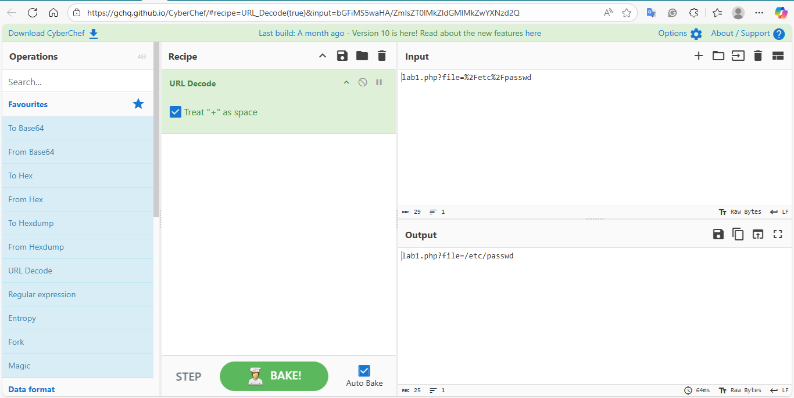
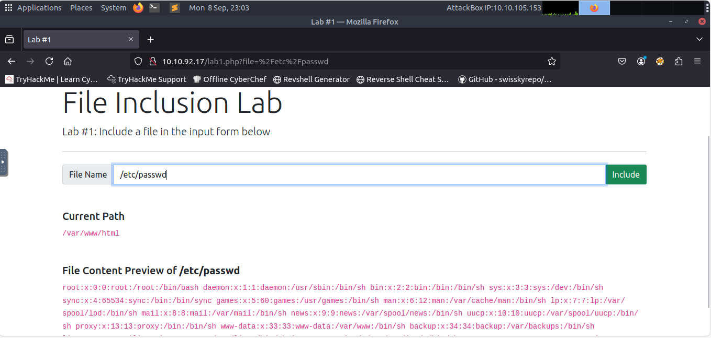

# Lab Title: LFI Lab #1 - Read /etc/passwd
Date: 2025-09-08

## Target
- TryHackMe LFI room (Lab #1)

## Commands / Steps
Request URI: 
http://10.10.92.17/lab1.php?file=%2Fetc/passwd

Encoded URI (decoded using CyberChef):
lab1.php?file=%2Fetc%2Fpasswd

## Results
- Successfully read `/etc/passwd` file contents
- Learned that LFI can expose sensitive system files

## Screenshots

## What I Learned
- LFI allows attackers to read sensitive files
- URL encoding (%2F for /) can bypass naive input filters
- Always validate and sanitize user input to prevent LFI
