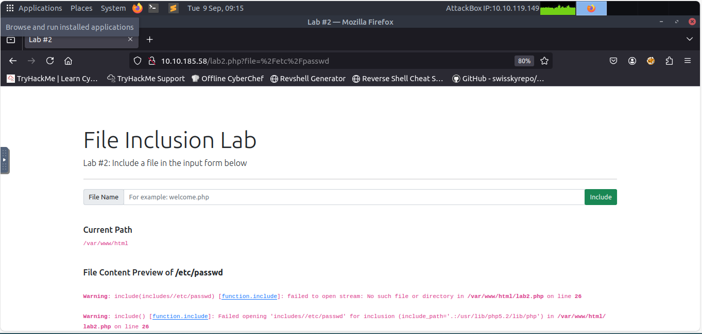

# Lab Title: LFI Lab #2 - Directory Traversal in includes
Date: 2025-09-09

## Target
- TryHackMe LFI room (Lab #2)

## Commands / Steps 
- Observed the PHP code uses `include("includes/...")`
- Tried directory traversal with `../` to break out of the `includes` directory
- Request URI example:
http://10.10.92.17/lab3.php?file=/etc/passwd

## Results
- The vulnerable code attempts to restrict inclusion to the `includes` directory
- Using `../` traversal, I escaped the restriction and accessed sensitive files
- Successfully demonstrated reading `/etc/passwd`

## Screenshots

## What I Learned
- Many apps use subdirectories (like `includes`) to store files
- Directory traversal (`../`) can bypass restrictions
- Developers should use allowlists or realpath() to prevent escaping
