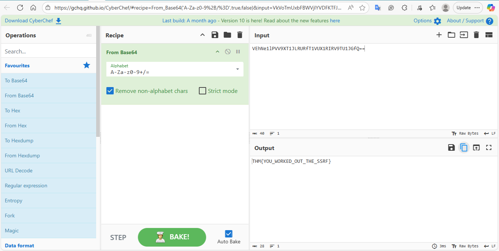
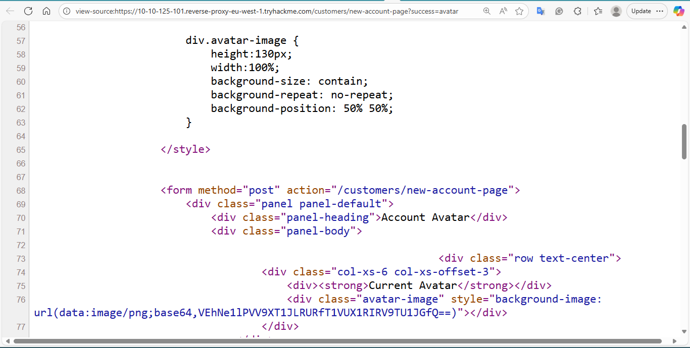

# Lab Title: SSRF Lab – Avatar Path Traversal
Date: 2025-09-10

## Target
- TryHackMe – Intro to SSRF (Acme I.T. Avatar Feature)

## Commands / Steps 
- Created a customer account on the Acme I.T. site and logged in.
- Navigated to the Avatar selection feature.
- Used browser DevTools (Inspect) to try toggling avatar visibility (failed due to restrictions).
- Crafted a path traversal payload in the avatar parameter: x/../private → This bypassed the restriction and allowed    access to the private avatar folder.
- Opened the private avatar’s source code, found a Base64-encoded string.
- Decoded the Base64 string using CyberChef to reveal the hidden flag/secret.

## Results
- Successfully bypassed avatar restrictions with ../ traversal.
- Extracted sensitive data hidden in a Base64-encoded string.
- Confirmed that the server trusted unvalidated avatar input and fetched private resources.

## Screenshots
- 
- 

## What I Learned
- SSRF occurs when user input is used in server-side fetchers (like avatar loaders).
- Path traversal (../) can extend SSRF to reach sensitive internal files or directories.
- Base64 encoding is often used to obfuscate sensitive data; decoding can reveal secrets.
- Defense: validate and sanitize all user input, restrict URL/file fetchers to a safe whitelist, and disable directory traversal.